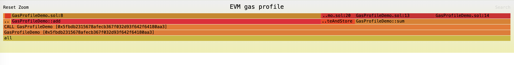
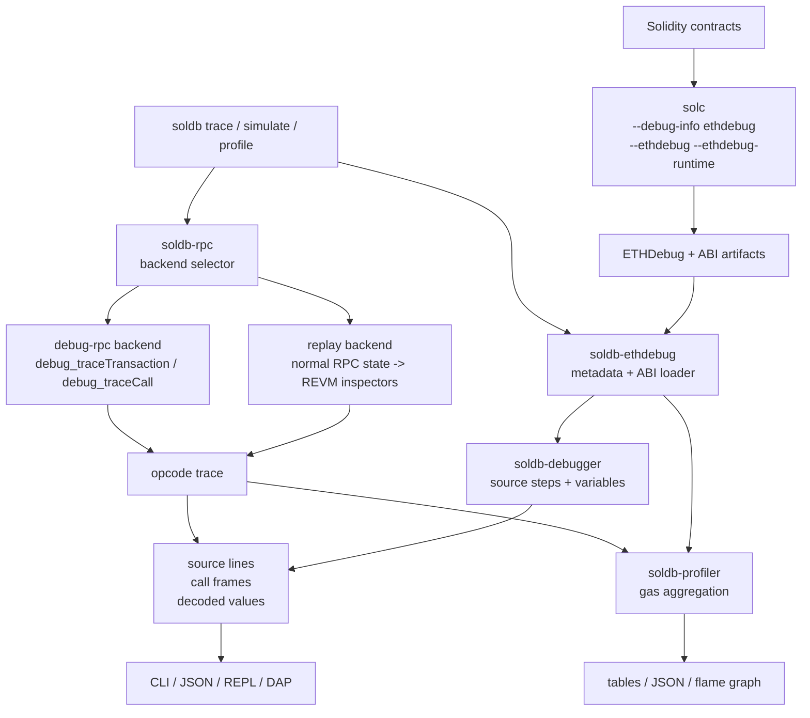

# SolDB – ETHDebug-First Solidity Debugger

[](https://github.com/walnuthq/soldb/actions/workflows/ci.yml)
[](#license)
[](https://www.rust-lang.org/)

> **Note**: SolDB is in public beta; expect ongoing changes and occasional inaccuracies.  

> **Note**: SolDB relies on compiler-generated debug metadata. ETHDebug gives the richest breakpoints, stepping, and variable views; legacy source maps provide source-level fallback.

SolDB is an open-source, ETHDebug-first, LLDB-style debugger for Solidity and the EVM.


---

## Quick Start

Install SolDB:
```bash
cargo install soldb
```

Optional debug-adapter binary:
```bash
cargo install soldb-dap
```

To track the development branch instead, install from git:
```bash
cargo install --git https://github.com/walnuthq/soldb.git soldb
```

Run against a local node (Anvil):
```bash
anvil --steps-tracing
```

Compile your contracts with ETHDebug (Solidity 0.8.29+):
```bash
solc --via-ir --debug-info ethdebug --ethdebug --ethdebug-runtime --bin --abi --overwrite -o out examples/Counter.sol
```

Legacy source maps are also accepted. For example, compile with Solar using
`-g source-maps --emit=abi,bin,bin-runtime --out-dir out`; SolDB reads
`combined.json` when ETHDebug programs are absent.

Trace a transaction:
```bash
soldb trace <tx_hash> --ethdebug-dir <contract_address>:<contract_name>:./out --rpc http://localhost:8545
```

Force the replay backend when you want to avoid `debug_traceTransaction`:
```bash
soldb trace <tx_hash> --backend replay --ethdebug-dir <contract_address>:<contract_name>:./out --rpc http://localhost:8545
```

Profile dynamic gas by contract, function, and source line, with an optional
interactive SVG flame graph:

```bash
soldb profile <tx_hash> --backend replay \
  --ethdebug-dir <contract_address>:<contract_name>:./out \
  --rpc http://localhost:8545 --flamegraph profile.svg
```

See [docs/profiling.md](docs/profiling.md) for captured traces, folded stacks,
multi-contract attribution, and the reusable library API.

---

## Example: Debugging a Transaction

```bash
soldb trace 0x2832...3994 --ethdebug-dir 0x3aa5ebb10dc797cac828524e59a333d0a371443c:TestContract:./out --rpc http://localhost:8545
```

Output:
```
Contract: TestContract
Gas used: 50835
Status: SUCCESS

Call Stack:
#0 TestContract::runtime_dispatcher [entry] @ TestContract.sol:1
  #1 increment [external] gas: 29241 @ TestContract.sol:23
    #2 increment2 [internal] gas: 6322 @ TestContract.sol:39
      #3 increment3 [internal] gas: 5172 @ TestContract.sol:54
```

Interactive mode:
```bash
soldb trace <tx_hash> --ethdebug-dir <contract_address>:<contract_name>:./out --rpc http://localhost:8545 --interactive
```

Inside REPL:
```
soldb> break TestContract.sol:42
soldb> next
soldb> print balance
```

---

## Example: Simulating a Contract Call

Test contract functions without sending transactions on chain.

```bash
soldb simulate <contract_address> "increment(uint256)" 10 --from <sender_address> --ethdebug-dir <contract_address>:<contract_name>:./out --rpc http://localhost:8545
```

Output containing a simulation failure:
```
Contract: TestContract
Gas used: 27157
Status: REVERTED
Error: Value must be even

Call Stack:
#0 TestContract::runtime_dispatcher [entry] @ TestContract.sol:1
  #1 increment [external] gas: 20835 @ TestContract.sol:23 
    #2 isEven [internal] gas: 6322 @ TestContract.sol:38 !!!
```

You can also pass complex types (structs, tuples):
```bash
soldb simulate <contract_address> "submitPerson((string,uint256))" '("Alice", 30)'     --from <sender_address>     --ethdebug-dir <contract_address>:<contract_name>:./out     --rpc http://localhost:8545
```

You can also debug simulations interactively using the `--interactive` flag:

```bash
soldb simulate <contract_address> "increment(uint256)" 5     --from <sender_address>     --ethdebug-dir <contract_address>:<contract_name>:./out     --rpc http://localhost:8545     --interactive
```

Inside REPL:
```
soldb> break TestContract.sol:38
soldb> step
soldb> vars
```

---

## Gas Profiling

`soldb profile` attributes dynamic EVM gas to contracts, functions, source
lines, opcodes, and instructions using compiler-generated debug metadata. It
can also generate an interactive flame graph. Legacy source maps retain exact
source-line attribution but do not carry ETHDebug function identities.



See the [profiling guide](docs/profiling.md) for usage and integration details.

---

## Features

- ETHDebug-first source debugging with legacy `srcmap`/`srcmap-runtime` fallback
- Source-level variable inspection (`vars`, `print <name>`) in both the REPL and the DAP
  server, decoded from ETHDebug variable locations
- Full transaction traces with internal calls & decoded parameters
- Dynamic gas profiles by contract, function, source line, opcode, and instruction
- Folded-stack and interactive SVG flame graph output
- Transaction simulation with arbitrary calldata (including structs & tuples)
- Interactive LLDB-like REPL (`step`, `break`, `print`, etc.) – works for both transactions and simulations
- HTTP/HTTPS JSON-RPC transport with debug-RPC tracing and normal-RPC replay for local Anvil transactions
- Interop-ready tracing for Ethereum environments that combine EVM contracts with other VMs

## Architecture

SolDB is split into focused crates so RPC transport, ETHDebug parsing, execution backends, CLI presentation, and interactive debugging can evolve independently.


```mermaid
flowchart TD
    contracts["Solidity contracts"] --> solc["solc<br/>--debug-info ethdebug<br/>--ethdebug --ethdebug-runtime"]
    solc --> artifacts["ETHDebug + ABI artifacts"]

    cli["soldb trace / simulate / profile"] --> metadata["soldb-ethdebug<br/>metadata + ABI loader"]
    artifacts --> metadata

    cli --> selector["soldb-rpc<br/>backend selector"]
    selector --> debug_rpc["debug-rpc backend<br/>debug_traceTransaction / debug_traceCall"]
    selector --> replay["replay backend<br/>normal RPC state -> REVM inspectors"]

    debug_rpc --> opcode_trace["opcode trace"]
    replay --> opcode_trace
    metadata --> debugger["soldb-debugger<br/>source steps + variables"]
    opcode_trace --> enriched
    debugger --> enriched["source lines<br/>call frames<br/>decoded values"]
    enriched --> outputs["CLI / JSON / REPL / DAP"]
    opcode_trace --> profiler["soldb-profiler<br/>gas aggregation"]
    metadata --> profiler
    profiler --> profile_outputs["tables / JSON / flame graph"]
```

SolDB relies on compiler-generated debug information. Pass an ETHDebug or
legacy combined-JSON artifact directory with
`--ethdebug-dir <address>:<contract>:<dir>`. ETHDebug provides source,
function, variable, and ABI context; legacy source maps provide PC-to-source
mapping and ABI data without inventing the missing metadata. The debugger-side
ETHDebug contract is documented in
[docs/ethdebug-debugger-contract.md](docs/ethdebug-debugger-contract.md).

The `--json` output for `trace` and `simulate` is versioned for web and explorer integrations. See [docs/json.md](docs/json.md) for the current schema, capability flags, replay artifacts, and compatibility rules.

### Execution Backends

The `trace` command supports three backend modes:

- `auto` (default): tries `debug-rpc` first, then falls back to `replay` when the node reports that `debug_traceTransaction` is unavailable.
- `debug-rpc`: calls `debug_traceTransaction` and is the fast path for Anvil, Geth, and other debug-capable nodes.
- `replay`: loads transaction, receipt, parent-block state, bytecode, balances, nonces, and storage through normal Ethereum JSON-RPC, replays prior transactions in the block when needed, then replays the target transaction in REVM with inspectors. It selects the REVM spec from chain/block/timestamp for mainnet, Sepolia, Holesky, and Hoodi; archive-provider hardening and broader cache tuning are next-stage work.

Select the backend explicitly:

```bash
soldb trace <tx_hash> --backend auto --ethdebug-dir <contract_address>:<contract_name>:./out --rpc http://localhost:8545
soldb trace <tx_hash> --backend debug-rpc --ethdebug-dir <contract_address>:<contract_name>:./out --rpc http://localhost:8545
soldb trace <tx_hash> --backend replay --ethdebug-dir <contract_address>:<contract_name>:./out --rpc http://localhost:8545
```

### Crates

- `crates/soldb-cli`: command-line interface, output formatting, and command wiring.
- `crates/soldb-core`: shared error types, trace models, and debugger data structures.
- `crates/soldb-rpc`: JSON-RPC transport, debug-RPC backend, replay backend, transaction simulation, and event log retrieval.
- `crates/soldb-ethdebug`: ETHDebug metadata loading, ABI helpers, source mapping, event decoding, and call-frame enrichment.
- `crates/soldb-debugger`: reusable source-step, function, and variable decoding model shared by frontends.
- `crates/soldb-profiler`: reusable gas attribution and folded-stack model over traces and ETHDebug programs.
- `crates/soldb-repl`: interactive debugger state and REPL commands.
- `crates/soldb-serializer`: JSON/web-facing trace and simulation serialization, including nested call trees and ETHDebug source metadata.
- `crates/soldb-compiler`: `solc` ETHDebug compilation, deployment helpers, and auto-deploy support for local workflows.
- `crates/soldb-bridge`: bridge server for cross-environment Solidity<>Stylus debugging.
- `crates/soldb-dap`: Debug Adapter Protocol server for editor integrations.

---

## Use Cases

- **Local Solidity debugging**  
  Step through Solidity execution, inspect variables, debug failing fuzz tests.

- **Transaction analysis**  
  Reproduce mainnet/testnet transactions locally, pinpoint reverts or unexpected flows.

- **Tooling integrations**  
  Generate full transaction traces for explorers and dev tools (already powering [Walnut](https://github.com/walnuthq/walnut)).

---

## Interop

Ethereum is moving toward richer interoperability, where applications may span multiple chains, execution environments, and VMs. SolDB is designed around that direction: keep Solidity and EVM debugging grounded in compiler-generated ETHDebug metadata, while allowing other execution environments to plug into the same trace, call-stack, and debugger-output model.

The goal is for developers to debug cross-environment transactions without switching mental models at every call boundary. EVM debug-RPC and replay remain the core path for Solidity execution, and bridge integrations can attach additional VM-specific debuggers as ecosystems adopt interop patterns.

Stylus is the first integrated non-EVM environment. Additional runtimes can follow the same bridge-oriented model.

See [docs/Stylus.md](docs/Stylus.md) for the current Stylus integration.

---

## Development

### Install From Source

```bash
git clone https://github.com/walnuthq/soldb.git
cd soldb
cargo build --workspace --all-targets
cargo install --path crates/soldb-cli
cargo install --path crates/soldb-dap
```

### Run Automated Tests

**Prerequisites**  
- Rust stable toolchain
- RPC at `http://localhost:8545` (Anvil default)  
- Anvil running with tracing enabled:  
  ```bash
  anvil --steps-tracing
  ```
- Solidity compiler:
  - `solc` 0.8.29+ for ETHDebug tests
  - `solc` 0.8.16 for legacy source-map tests
- LLVM tools (`lit`, `FileCheck`)  
  ```bash
    # Install LLVM
    # macOS
    brew install llvm
    # Ubuntu
    sudo apt-get install llvm-dev
  ```

Run unit tests:
```bash
cargo test --workspace --all-targets
```

Run lit end-to-end CLI tests:
```bash
./test/run-tests.sh SOLC_PATH=/path/to/solc
```

Run the full local test target:
```bash
make test
```

CI additionally runs the lit suite against `solc` built from the
[Solidity development branch](https://github.com/argotorg/solidity), where ETHDebug output
changes first. That job is non-blocking and also runs on a daily schedule. To reproduce it
locally, point the runner at your own build:

```bash
./test/run-tests.sh SOLC_PATH=/path/to/solidity/build/solc/solc
```

### Coverage

Line coverage is enforced at 80% in CI.

```bash
cargo llvm-cov --workspace --all-targets --fail-under-lines 80
make coverage
```

---

## License

SolDB is dual-licensed under the GNU General Public License v3.0 or the MIT
license, at your option: use, redistribute, and modify it under the terms of
either one. Unless you state otherwise, contributions you submit are
dual-licensed the same way.

📄 [GPL-3.0](./LICENSE.md) · [MIT](./LICENSE-MIT.md)

## Community & Support
💬 Join our Telegram: [@walnut_soldb](https://t.me/walnut_soldb)
📬 Email: hi@walnut.dev
