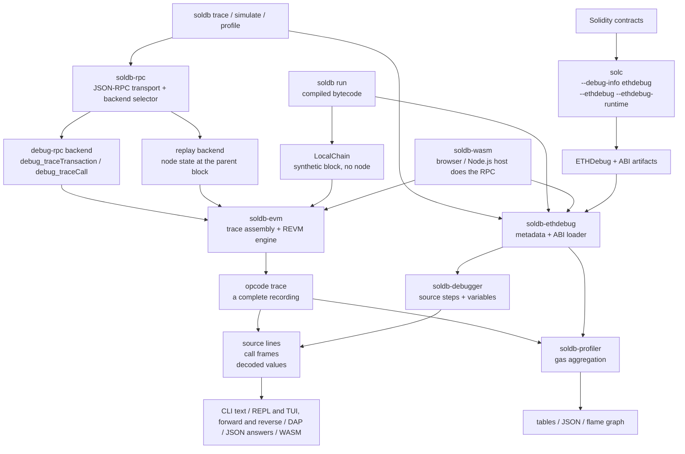

# SolDB – ETHDebug-First Solidity Debugger

[](https://github.com/walnuthq/soldb/actions/workflows/ci.yml)
[](#license)
[](https://www.rust-lang.org/)

> **Note**: SolDB is in public beta; expect ongoing changes and occasional inaccuracies.  

> **Note**: SolDB relies on compiler-generated debug metadata. ETHDebug gives the richest breakpoints, stepping, and variable views; legacy source maps provide source-level fallback.

SolDB is an LLDB-style debugger for Solidity and the EVM. It reads the ETHDebug metadata
a Solidity compiler emits (legacy source maps work too), replays a transaction, and lets
you step through it by source line, forward and backward, with variables decoded. It is
the engine behind [Walnut](https://github.com/walnuthq/walnut).


## Install

```bash
cargo install soldb        # the debugger
cargo install soldb-dap    # optional: Debug Adapter Protocol server for editors
```

To follow the development branch instead:

```bash
cargo install --git https://github.com/walnuthq/soldb.git soldb
```

## Try It

`soldb run` deploys a contract on a throwaway chain and calls it, so nothing else needs to
be running. [`examples/Shop.sol`](https://github.com/walnuthq/soldb/blob/main/examples/Shop.sol)
exercises most of what the debugger can show. Compile it with solc's legacy pipeline; its
fixed stack layout is what lets the debugger read local variables (see
[Variables](https://github.com/walnuthq/soldb/blob/main/docs/commands.md#variables)):

```bash
cd examples
solc --evm-version cancun Shop.sol --bin --abi --combined-json abi,bin,bin-runtime,srcmap,srcmap-runtime,storage-layout -o out_shop --overwrite
soldb run out_shop/Shop.bin "place(string,uint128,uint256)" widget 5 3 --ethdebug-dir 0x5fbdb2315678afecb367f032d93f642f64180aa3:Shop:out_shop -i
```

At the prompt:

```text
soldb> break Shop.sol:40
Breakpoint #1 set at Shop.sol:40
soldb> continue
Breakpoint #1 hit at step 1444, Shop.sol:40
Shop.sol:40 in place  (step 1444/2142, pc 699, PUSH2, gas 29795966)
   40 |         revenue += total(order);
soldb> vars
string memory item = "widget" [stack+2]
uint128 unitPrice = 5 [stack+3]
uint256 count = 3 [stack+4]
uint256 id = 1 [stack+5]
Order memory order = { id: 1, item: "widget", price: 5, status: Status.Open, quantities: [1, 2, 3] } [stack+6]
State:
mapping(uint256 => struct Shop.Order) orders = <mapping; index it with [key]> [slot 0x0]
uint256 nextId = 1 [slot 0x1]
...
soldb> print order.quantities[2]
uint256 order.quantities[2] = 3 [stack+6]
soldb> print orders[1].status
enum Shop.Status orders[1].status = Status.Paid [slot 0xada5…e7f + 16]
soldb> step
Shop.sol:69 in total  (step 1448/2142, pc 1376, JUMPDEST, gas 29795949)
   69 |     function total(Order memory order) internal pure returns (uint256 sum) {
soldb> break Shop.sol:72 if sum > 10
soldb> continue
Breakpoint #2 hit at step 1826, Shop.sol:72 if sum > 10
Shop.sol:72 in total  (step 1826/2142, pc 1404, DUP4, gas 29794734)
   72 |             sum += unit * order.quantities[i];
soldb> bt
#0  total at Shop.sol:72  step 1826, PC 1404
#1  place at Shop.sol:40  step 1447, PC 706
#2  Shop at Shop.sol:8  step 33, PC 62
soldb> reverse-next
soldb> tui
```

The same session as a single command, and as JSON:

```bash
soldb run out_shop/Shop.bin "place(string,uint128,uint256)" widget 5 3 --ethdebug-dir 0x5fbd…:Shop:out_shop \
    -x 'break Shop.sol:72 if sum > 10' -x continue -x vars -x bt --batch
soldb run out_shop/Shop.bin "place(string,uint128,uint256)" widget 5 3 --ethdebug-dir 0x5fbd…:Shop:out_shop \
    -x 'break Shop.sol:72 if sum > 10' -x continue -x 'print sum' --batch --json
```

`--tui` starts in the full-screen view instead.

## Debug a Transaction

Start a node that can trace, for example Anvil:

```bash
anvil --steps-tracing
```

Compile with ETHDebug (Solidity 0.8.29+):

```bash
solc --via-ir --debug-info ethdebug --ethdebug --ethdebug-runtime --bin --abi --overwrite -o out examples/Counter.sol
```

Or let SolDB drive solc, which also requests the storage layout used to read state variables:

```bash
soldb compile src/Token.sol -o out
```

Inside a project, `soldb compile` takes the base path and remappings from the nearest
`foundry.toml`, `remappings.txt`, or Hardhat config and searches `lib` and `node_modules`
for imports. `--base-path`, `--include-path`, `--remapping`, and `--no-project` override
that.

Contracts built by older compilers work through their legacy source maps: SolDB reads
`combined.json` when ETHDebug programs are absent. If the sources are not next to the
artifacts, pass `--source-path <dir>`.

Trace a transaction:

```bash
soldb trace <tx_hash> --ethdebug-dir <contract_address>:<contract_name>:./out --rpc http://localhost:8545
```

```
Contract: TestContract
Gas used: 50835
Status: SUCCESS

Call Stack:
#0 TestContract::runtime_dispatcher [entry] @ TestContract.sol:1
  #1 increment [external] gas: 29241 @ TestContract.sol:23
    #2 increment2 [internal] gas: 6322 @ TestContract.sol:39
      #3 increment3 [internal] gas: 5172 @ TestContract.sol:54
```

Add `--interactive` (or `-i`) to step through it:

```
soldb> break TestContract.sol:42
Breakpoint #1 set at TestContract.sol:42
soldb> continue
Breakpoint #1 hit at step 299, TestContract.sol:42
TestContract.sol:42 in increment  (step 299/1071, pc 1899, PUSH2, gas 955476)
   42 |         balance += amount;
soldb> print balance
uint256 balance = 10 [slot 0x0]
```

The same session scripted, and as JSON:

```bash
soldb trace <tx_hash> --ethdebug-dir … --rpc … -x 'break TestContract.sol:42' -x continue -x vars --batch
soldb trace <tx_hash> --ethdebug-dir … --rpc … -x 'break TestContract.sol:42' -x continue -x vars --batch --json
```

And as a full-screen view (`--tui`, or the `tui` command at the prompt):

```
┌ Source ──────────────────────────────────┬ Variables ─────────────────────────┐
│    40 |     function increment(uint256 a)│ uint256 amount = 4 [stack+2]       │
│ *  41 |         require(amount > 0);     │ uint256 twice = 8 [stack+4]        │
│ => 42 |         balance += amount;       │ State:                             │
│    43 |         emit Incremented(amount);│ uint256 balance = 10 [slot 0x0]    │
├ Opcodes ─────────────────────────────────┼ Stack ─────────────────────────────┤
│ =>  1899 PUSH2 0x0771                    │ [ 4] 0x8                           │
│     1902 JUMP                            │ [ 3] 0x0                           │
├ Backtrace ───────────────┬ Console ───────┴────────────────────────────────────┤
│ #0  increment at :42     │ soldb> continue                                     │
│ #1  TestContract at :4   │ Breakpoint #1 hit at step 299, TestContract.sol:42  │
├──────────────────────────┴─────────────────────────────────────────────────────┤
│ step 299/1071  pc 1899  PUSH2  gas 955476  TestContract.sol:42 in increment    │
│ n/s/c/f/i step  N/S/C/F/I back  b break  m mode  : command  Tab focus  ? help  │
└────────────────────────────────────────────────────────────────────────────────┘
```

If the node cannot trace, `--backend replay` fetches the state it needs and replays the
transaction locally in REVM. See [Execution Backends](#execution-backends).

## Simulate a Call

`soldb simulate` runs a call against the current chain state without sending a transaction:

```bash
soldb simulate <contract_address> "increment(uint256)" 10 --from <sender_address> --ethdebug-dir <contract_address>:<contract_name>:./out --rpc http://localhost:8545
```

```
Contract: TestContract
Gas used: 27157
Status: REVERTED
Error: Value must be even

Call Stack:
#0 TestContract::runtime_dispatcher [entry] @ TestContract.sol:1
  #1 increment [external] gas: 20835 @ TestContract.sol:23
    #2 isEven [internal] gas: 6322 @ TestContract.sol:38 !!!
```

Structs and tuples are passed as tuples, and `--interactive` works here as well:

```bash
soldb simulate <contract_address> "submitPerson((string,uint256))" '("Alice", 30)' --from <sender_address> --ethdebug-dir <contract_address>:<contract_name>:./out --rpc http://localhost:8545
soldb simulate <contract_address> "increment(uint256)" 5 --from <sender_address> --ethdebug-dir <contract_address>:<contract_name>:./out --rpc http://localhost:8545 --interactive
```

## Profile Gas

`soldb profile` attributes gas to contracts, functions, source lines, opcodes, and
instructions, and can write an interactive flame graph:

```bash
soldb profile <tx_hash> --backend replay \
  --ethdebug-dir <contract_address>:<contract_name>:./out \
  --rpc http://localhost:8545 --flamegraph profile.svg
```


Legacy source maps give exact line attribution but carry no function identities. See
[docs/profiling.md](https://github.com/walnuthq/soldb/blob/main/docs/profiling.md) for
captured traces, folded stacks, multi-contract attribution, and the library API.

## Compare Compiler Debug Info

`soldb debug-diff` runs the same transaction through two compiler outputs and compares
what a debugger would show: source steps, exact spans, or line coverage. ETHDebug and
legacy source maps can be compared in any combination. CI uses it to check
[Solar](https://github.com/paradigmxyz/solar) against solc.

```bash
soldb debug-diff \
  --reference-tx <solc_tx_hash> \
  --candidate-tx <candidate_tx_hash> \
  --reference-ethdebug-dir <solc_address>:<contract>:<solc_out> \
  --candidate-ethdebug-dir <candidate_address>:<contract>:<candidate_out> \
  --rpc http://localhost:8545
```

See [docs/debug-diff.md](https://github.com/walnuthq/soldb/blob/main/docs/debug-diff.md).

## Scripting and Agents

SolDB is a terminal program end to end, so it can be driven by scripts and AI agents as
easily as by a person. Commands can be given with `-x` (repeatable), and `--batch` exits
once they have run, so a whole session is one shell command. `--json` turns every answer
into one JSON object per line. When stdin or stdout is not a terminal there is no prompt,
banner, or colour. Editors use the same engine through `soldb-dap`. See
[docs/commands.md](https://github.com/walnuthq/soldb/blob/main/docs/commands.md#scripting-and-json).

## Features

- Source-level debugging from ETHDebug metadata, with legacy `srcmap` fallback
- Use it from a gdb-style command prompt, a full-screen terminal UI (`--tui`), or your editor through the Debug Adapter Protocol (`soldb-dap`)
- Step forward and backward by source line or instruction; `goto` any step
- Breakpoints on lines, functions, storage writes, reverts, calls, and opcodes, with conditions on variables
- Locals and state variables decoded by type, including memory structs, arrays, strings, calldata slices, mappings, and enums; `print` follows paths such as `orders[1].status`
- Call stack with decoded arguments; stack, memory, storage, and calldata at any step
- Transaction traces, call simulation, and `soldb run` for compiled bytecode with no node
- Replay backend for nodes without `debug_traceTransaction`; `--save-replay` files reproduce a trace on any machine
- Gas profiles by contract, function, line, opcode, and instruction, with flame graphs
- `debug-diff` for comparing the debug information of two compilers
- `-x`, `--batch`, `--json`, and `--save-trace` for scripting
- WebAssembly bindings, and Stylus interop through a bridge

## Architecture

SolDB is split into focused crates so the RPC transport, the execution engine, ETHDebug
parsing, CLI presentation, and interactive debugging can evolve independently.


```mermaid
flowchart TD
    contracts["Solidity contracts"] --> solc["solc<br/>--debug-info ethdebug<br/>--ethdebug --ethdebug-runtime"]
    solc --> artifacts["ETHDebug + ABI artifacts"]

    cli["soldb trace / simulate / profile"] --> metadata["soldb-ethdebug<br/>metadata + ABI loader"]
    run["soldb run<br/>compiled bytecode"] --> metadata
    wasm["soldb-wasm<br/>browser / Node.js host does the RPC"] --> metadata
    artifacts --> metadata

    cli --> selector["soldb-rpc<br/>JSON-RPC transport + backend selector"]
    selector --> debug_rpc["debug-rpc backend<br/>debug_traceTransaction / debug_traceCall"]
    selector --> replay["replay backend<br/>node state at the parent block"]
    run --> local["LocalChain<br/>synthetic block, no node"]

    debug_rpc --> engine["soldb-evm<br/>trace assembly + REVM engine"]
    replay --> engine
    local --> engine
    wasm --> engine
    engine --> opcode_trace["opcode trace<br/>a complete recording"]
    metadata --> debugger["soldb-debugger<br/>source steps + variables"]
    opcode_trace --> enriched
    debugger --> enriched["source lines<br/>call frames<br/>decoded values"]
    enriched --> outputs["CLI text / REPL and TUI, forward and reverse / DAP / JSON answers / WASM"]
    opcode_trace --> profiler["soldb-profiler<br/>gas aggregation"]
    metadata --> profiler
    profiler --> profile_outputs["tables / JSON / flame graph"]
```

SolDB relies on compiler-generated debug information, passed as
`--ethdebug-dir <address>:<contract>:<dir>`. ETHDebug provides source, function, variable,
and ABI context; legacy source maps provide PC-to-source mapping and ABI data, and SolDB
does not invent what they lack. What the debugger expects from ETHDebug is written down in
[docs/ethdebug-debugger-contract.md](https://github.com/walnuthq/soldb/blob/main/docs/ethdebug-debugger-contract.md).

`--save-trace <FILE>` on `trace`, `simulate`, `run`, and `replay` writes the complete
trace as JSON, which `debug-diff` and `profile` read offline.

### Execution Backends

`trace` and `simulate` support three backends:

- `auto` (default): tries `debug-rpc`, then falls back to `replay` when the node reports
  that `debug_traceTransaction` is unavailable.
- `debug-rpc`: calls `debug_traceTransaction`; the fast path for Anvil, Geth, and other
  nodes that can trace.
- `replay`: loads the transaction, receipt, parent-block state, bytecode, balances,
  nonces, and storage over plain JSON-RPC, replays the earlier transactions in the block
  when needed, and then runs the target transaction in REVM. The REVM spec is chosen from
  the chain, block, and timestamp for mainnet, Sepolia, Holesky, and Hoodi. EVM-equivalent
  chains such as the OP stack, Base, BNB Smart Chain, and Polygon PoS replay under Ethereum
  rules at the latest fork, with a note in the trace that their fee and gas accounting is
  not modelled. Chains whose execution differs from the EVM (Arbitrum, zkSync Era, Polygon
  zkEVM) are refused with a message naming the chain.

```bash
soldb trace <tx_hash> --backend replay --ethdebug-dir <contract_address>:<contract_name>:./out --rpc http://localhost:8545
```

With `--backend replay`, `simulate` executes the call against the chain as it stood at
`--block`, or with `--tx-index` inside that block after the transactions before that
index. That is a fork of the chain at any point, with full stepping, from any node that
serves state at that block.

```bash
soldb simulate <contract> "increment(uint256)" 4 --from <address> --backend replay --block 12345 --rpc <url>
```

### Replay Files

A replay run reads a bounded amount of state from the node. `--save-replay` writes all of
it, with the transaction or call, its block, and the chain id, to one file, and
`soldb replay` reproduces the same trace from that file without a node:

```bash
soldb trace <tx_hash> --backend replay --save-replay bug.json --rpc <url>
soldb simulate <contract> "increment(uint256)" 4 --from <address> --backend replay --save-replay bug.json --rpc <url>
soldb replay bug.json --ethdebug-dir <contract_address>:<contract_name>:./out -i
```

Attach the file to a bug report and anyone can step through the same execution.

### Running Bytecode Without a Node

`soldb run` debugs compiled bytecode on a chain that exists only for that run. The creation
code is deployed from the first Anvil account, so the contract lands at the address Anvil
would give it, and the call runs right after the constructor in the same block. Everything
after that is the same as for `simulate`: source mapping through `--ethdebug-dir`, the
interactive debugger with reverse stepping, and the raw view.

```bash
soldb run out/Counter.bin "increment(uint256)" 4 --ethdebug-dir 0x5FbDB2315678afecB367f032d93F642f64180aa3:Counter:./out
soldb run out/Counter.bin --deploy --raw                 # trace the constructor itself
soldb run 0x6000405060005460010160005500 --runtime --storage 0x0=0x29 --raw   # raw runtime code, a slot seeded
```

`--constructor-args` are encoded against the ABI next to the ETHDebug artifacts, and
`--constructor-value` funds a payable constructor. `--from`, `--balance`, `--value`,
`--chain-id`, `--block-number`, `--timestamp`, and `--gas-limit` shape the caller and the
block; `--address` places `--runtime` code.

### Time Travel

A trace is a complete recording, so the debugger and the DAP server move backward as
freely as forward: `reverse-next`, `reverse-step`, `reverse-finish`, `reverse-nexti` (or
`back`), and `reverse-continue` mirror their forward counterparts, `goto <step>` jumps to
any instruction, and an editor's step-back button works. Breakpoints are predicates on a
step, so `break storage 0` or `break revert` is a search over the recording in either
direction. See [docs/commands.md](https://github.com/walnuthq/soldb/blob/main/docs/commands.md).

### Crates

- `crates/soldb-cli`: command-line interface, output formatting, and command wiring.
- `crates/soldb-core`: shared error types, trace models, and debugger data structures.
- `crates/soldb-evm`: the execution engine: node data shapes, trace assembly, and the REVM replay engine that also runs bytecode on a local chain.
- `crates/soldb-rpc`: JSON-RPC transport, debug-RPC backend, the node side of the replay backend, transaction simulation, and event log retrieval.
- `crates/soldb-ethdebug`: ETHDebug metadata loading, ABI helpers, source mapping, event decoding, and call-frame enrichment.
- `crates/soldb-debugger`: source-step, function, and variable decoding shared by all frontends.
- `crates/soldb-profiler`: gas attribution and folded-stack model over traces and ETHDebug programs.
- `crates/soldb-repl`: the command language, session, and answers; the state machine every frontend drives.
- `crates/soldb-tui`: the full-screen terminal view over a session.
- `crates/soldb-wasm`: WebAssembly bindings that build a trace and run a host-driven REVM replay in a browser or Node.js.
- `crates/soldb-compiler`: `solc` ETHDebug compilation, deployment helpers, and auto-deploy for local workflows.
- `crates/soldb-bridge`: bridge server for cross-environment Solidity and Stylus debugging.
- `crates/soldb-dap`: Debug Adapter Protocol server for editor integrations.

## Interop

Applications increasingly span several execution environments. SolDB keeps Solidity
debugging grounded in compiler-generated metadata and lets other environments plug into the
same trace, call-stack, and output model. Stylus is the first; see
[docs/Stylus.md](https://github.com/walnuthq/soldb/blob/main/docs/Stylus.md).

## Development

### Build From Source

```bash
git clone https://github.com/walnuthq/soldb.git
cd soldb
cargo build --workspace --all-targets
cargo install --path crates/soldb-cli
cargo install --path crates/soldb-dap
```

### Tests

The end-to-end tests need Anvil running with `anvil --steps-tracing`, `solc` 0.8.29+ for
ETHDebug (0.8.16 for the legacy source-map tests), and LLVM's `lit` and `FileCheck`
(`brew install llvm` or `apt-get install llvm-dev`).

```bash
cargo test --workspace --all-targets            # unit tests
./test/run-tests.sh SOLC_PATH=/path/to/solc     # lit end-to-end CLI tests
make test                                       # both
```

CI also runs the lit suite against `solc` built from the
[Solidity development branch](https://github.com/argotorg/solidity) and against Solar
`main`. Both jobs are non-blocking early warnings. To reproduce the solc one locally, point
the runner at your own build:

```bash
./test/run-tests.sh SOLC_PATH=/path/to/solidity/build/solc/solc
```

### Coverage

Line coverage is enforced at 80% in CI:

```bash
cargo llvm-cov --workspace --all-targets --fail-under-lines 80
make coverage
```

### WebAssembly

The library crates build for `wasm32-unknown-unknown`, and `crates/soldb-wasm` packages
them for a browser or Node.js host with `wasm-pack`. The host does the network and
filesystem work and hands JSON-RPC responses and ETHDebug artifacts in as strings; the
trace stays in WebAssembly memory between calls.

```bash
rustup target add wasm32-unknown-unknown
cargo install wasm-pack
make wasm         # crates/soldb-wasm/pkg (lean) and pkg-replay (with REVM)
make wasm-test    # bindings smoke tests under Node.js
```

See [docs/wasm.md](https://github.com/walnuthq/soldb/blob/main/docs/wasm.md).

## License

SolDB is dual-licensed under the GNU General Public License v3.0 or the MIT license, at
your option. Unless you state otherwise, contributions you submit are dual-licensed the
same way.

📄 [GPL-3.0](https://github.com/walnuthq/soldb/blob/main/LICENSE.md) · [MIT](https://github.com/walnuthq/soldb/blob/main/LICENSE-MIT.md)

## Community & Support

📬 Email: hi@walnut.dev
