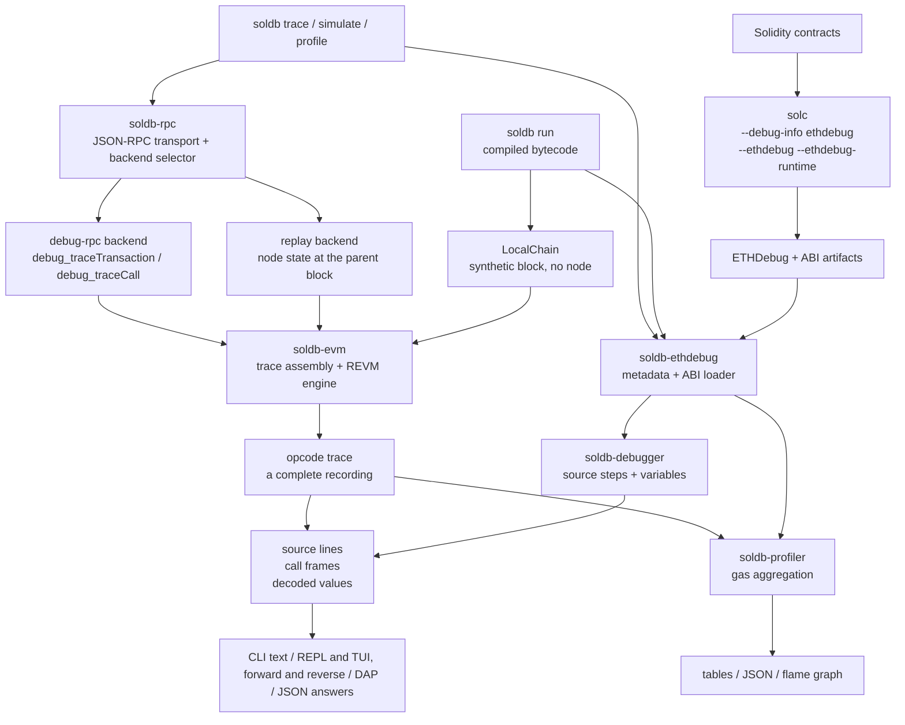

# SolDB – ETHDebug-First Solidity Debugger

[](https://github.com/walnuthq/soldb/actions/workflows/ci.yml)
[](#license)
[](https://www.rust-lang.org/)

> **Note**: SolDB is in public beta; expect ongoing changes and occasional inaccuracies.  

> **Note**: SolDB relies on compiler-generated debug metadata. ETHDebug gives the richest breakpoints, stepping, and variable views; legacy source maps provide source-level fallback.

SolDB is an open-source, ETHDebug-first, LLDB-style debugger for Solidity and the EVM.


---

## Try It in Two Minutes

No node, no project: `soldb run` deploys a contract on a chain that exists only for the
run and calls it. [`examples/Shop.sol`](examples/Shop.sol) has one of everything the
debugger can show. Compile it with solc's legacy pipeline, whose fixed stack layout is
what lets the debugger read local variables (see [Variables](docs/commands.md#variables)):

```bash
cargo install soldb
cd examples
solc --evm-version cancun Shop.sol --bin --abi --combined-json abi,bin,bin-runtime,srcmap,srcmap-runtime,storage-layout -o out_shop --overwrite
soldb run out_shop/Shop.bin "place(string,uint128,uint256)" widget 5 3 --ethdebug-dir 0x5fbdb2315678afecb367f032d93f642f64180aa3:Shop:out_shop -i
```

Then, at the prompt:

```text
soldb> break Shop.sol:40
Breakpoint #1 set at Shop.sol:40
soldb> continue
Breakpoint #1 hit at step 1444, Shop.sol:40
Shop.sol:40 in place  (step 1444/2142, pc 699, PUSH2, gas 29795966)
   40 |         revenue += total(order);
soldb> vars
string memory item = "widget" [stack+2]
uint128 unitPrice = 5 [stack+3]
uint256 count = 3 [stack+4]
uint256 id = 1 [stack+5]
Order memory order = { id: 1, item: "widget", price: 5, status: Status.Open, quantities: [1, 2, 3] } [stack+6]
State:
mapping(uint256 => struct Shop.Order) orders = <mapping; index it with [key]> [slot 0x0]
uint256 nextId = 1 [slot 0x1]
...
soldb> print order.quantities[2]
uint256 order.quantities[2] = 3 [stack+6]
soldb> print orders[1].status
enum Shop.Status orders[1].status = Status.Paid [slot 0xada5…e7f + 16]
soldb> step
Shop.sol:69 in total  (step 1448/2142, pc 1376, JUMPDEST, gas 29795949)
   69 |     function total(Order memory order) internal pure returns (uint256 sum) {
soldb> break Shop.sol:72 if sum > 10
soldb> continue
Breakpoint #2 hit at step 1826, Shop.sol:72 if sum > 10
Shop.sol:72 in total  (step 1826/2142, pc 1404, DUP4, gas 29794734)
   72 |             sum += unit * order.quantities[i];
soldb> bt
#0  total at Shop.sol:72  step 1826, PC 1404
#1  place at Shop.sol:40  step 1447, PC 706
#2  Shop at Shop.sol:8  step 33, PC 62
soldb> reverse-next
soldb> tui
```

The same session as one command, and as JSON:

```bash
soldb run out_shop/Shop.bin "place(string,uint128,uint256)" widget 5 3 --ethdebug-dir 0x5fbd…:Shop:out_shop \
    -x 'break Shop.sol:72 if sum > 10' -x continue -x vars -x bt --batch
soldb run out_shop/Shop.bin "place(string,uint128,uint256)" widget 5 3 --ethdebug-dir 0x5fbd…:Shop:out_shop \
    -x 'break Shop.sol:72 if sum > 10' -x continue -x 'print sum' --batch --json
```

`--tui` starts in the full-screen view instead.

---

## Quick Start

Install SolDB:
```bash
cargo install soldb
```

Optional debug-adapter binary:
```bash
cargo install soldb-dap
```

To track the development branch instead, install from git:
```bash
cargo install --git https://github.com/walnuthq/soldb.git soldb
```

Run against a local node (Anvil):
```bash
anvil --steps-tracing
```

Compile your contracts with ETHDebug (Solidity 0.8.29+):
```bash
solc --via-ir --debug-info ethdebug --ethdebug --ethdebug-runtime --bin --abi --overwrite -o out examples/Counter.sol
```

Or let SolDB drive the compiler, which also asks for the storage layout the debugger
reads state variables from:
```bash
soldb compile src/Token.sol -o out
```

Inside a project it resolves imports the way the project does: the nearest directory
holding a `foundry.toml`, a `remappings.txt`, or a Hardhat config is the base path — the
search stops at the checkout, so nothing outside it can claim a contract inside — `lib`
and `node_modules` are searched for non-relative imports, and the project's remappings are
applied. It prints what it found, and `--base-path`, `--include-path`, `--remapping`, and
`--no-project` override it.

Legacy source maps are also accepted: SolDB reads `combined.json` when ETHDebug
programs are absent, so contracts built by pre-ETHDebug compilers still debug by
source line, function, and frame. When the sources those artifacts name are not next to
them, pass `--source-path <dir>` — the directory the contract was compiled in.

Trace a transaction:
```bash
soldb trace <tx_hash> --ethdebug-dir <contract_address>:<contract_name>:./out --rpc http://localhost:8545
```

Force the replay backend when you want to avoid `debug_traceTransaction`:
```bash
soldb trace <tx_hash> --backend replay --ethdebug-dir <contract_address>:<contract_name>:./out --rpc http://localhost:8545
```

Profile dynamic gas by contract, function, and source line, with an optional
interactive SVG flame graph:

```bash
soldb profile <tx_hash> --backend replay \
  --ethdebug-dir <contract_address>:<contract_name>:./out \
  --rpc http://localhost:8545 --flamegraph profile.svg
```

See [docs/profiling.md](docs/profiling.md) for captured traces, folded stacks,
multi-contract attribution, and the reusable library API.

Compare the source-level debugging experience of two compiler outputs:

```bash
soldb debug-diff \
  --reference-tx <solc_tx_hash> \
  --candidate-tx <candidate_tx_hash> \
  --reference-ethdebug-dir <solc_address>:<contract>:<solc_out> \
  --candidate-ethdebug-dir <candidate_address>:<contract>:<candidate_out> \
  --rpc http://localhost:8545
```

See [docs/debug-diff.md](docs/debug-diff.md) for strict source-step, exact-span,
and optimization-tolerant coverage comparisons.

---

## Example: Debugging a Transaction

```bash
soldb trace 0x2832...3994 --ethdebug-dir 0x3aa5ebb10dc797cac828524e59a333d0a371443c:TestContract:./out --rpc http://localhost:8545
```

Output:
```
Contract: TestContract
Gas used: 50835
Status: SUCCESS

Call Stack:
#0 TestContract::runtime_dispatcher [entry] @ TestContract.sol:1
  #1 increment [external] gas: 29241 @ TestContract.sol:23
    #2 increment2 [internal] gas: 6322 @ TestContract.sol:39
      #3 increment3 [internal] gas: 5172 @ TestContract.sol:54
```

Interactive mode:
```bash
soldb trace <tx_hash> --ethdebug-dir <contract_address>:<contract_name>:./out --rpc http://localhost:8545 --interactive
```

Inside the REPL:
```
soldb> break TestContract.sol:42
Breakpoint #1 set at TestContract.sol:42
soldb> continue
Breakpoint #1 hit at step 299, TestContract.sol:42
TestContract.sol:42 in increment  (step 299/1071, pc 1899, PUSH2, gas 955476)
   42 |         balance += amount;
soldb> print balance
uint256 balance = 10 [slot 0x0]
```

The same session as a script, and as JSON for a tool or an agent to read:
```bash
soldb trace <tx_hash> --ethdebug-dir … --rpc … -x 'break TestContract.sol:42' -x continue -x vars --batch
soldb trace <tx_hash> --ethdebug-dir … --rpc … -x 'break TestContract.sol:42' -x continue -x vars --batch --json
```

And as a full-screen view (`--tui`, or the `tui` command from the prompt):

```
┌ Source ──────────────────────────────────┬ Variables ─────────────────────────┐
│    40 |     function increment(uint256 a)│ uint256 amount = 4 [stack+2]       │
│ *  41 |         require(amount > 0);     │ uint256 twice = 8 [stack+4]        │
│ => 42 |         balance += amount;       │ State:                             │
│    43 |         emit Incremented(amount);│ uint256 balance = 10 [slot 0x0]    │
├ Opcodes ─────────────────────────────────┼ Stack ─────────────────────────────┤
│ =>  1899 PUSH2 0x0771                    │ [ 4] 0x8                           │
│     1902 JUMP                            │ [ 3] 0x0                           │
├ Backtrace ───────────────┬ Console ───────┴────────────────────────────────────┤
│ #0  increment at :42     │ soldb> continue                                     │
│ #1  TestContract at :4   │ Breakpoint #1 hit at step 299, TestContract.sol:42  │
├──────────────────────────┴─────────────────────────────────────────────────────┤
│ step 299/1071  pc 1899  PUSH2  gas 955476  TestContract.sol:42 in increment    │
│ n/s/c/f/i step  N/S/C/F/I back  b break  m mode  : command  Tab focus  ? help  │
└────────────────────────────────────────────────────────────────────────────────┘
```

---

## Example: Simulating a Contract Call

Test contract functions without sending transactions on chain.

```bash
soldb simulate <contract_address> "increment(uint256)" 10 --from <sender_address> --ethdebug-dir <contract_address>:<contract_name>:./out --rpc http://localhost:8545
```

Output containing a simulation failure:
```
Contract: TestContract
Gas used: 27157
Status: REVERTED
Error: Value must be even

Call Stack:
#0 TestContract::runtime_dispatcher [entry] @ TestContract.sol:1
  #1 increment [external] gas: 20835 @ TestContract.sol:23 
    #2 isEven [internal] gas: 6322 @ TestContract.sol:38 !!!
```

You can also pass complex types (structs, tuples):
```bash
soldb simulate <contract_address> "submitPerson((string,uint256))" '("Alice", 30)'     --from <sender_address>     --ethdebug-dir <contract_address>:<contract_name>:./out     --rpc http://localhost:8545
```

You can also debug simulations interactively using the `--interactive` flag:

```bash
soldb simulate <contract_address> "increment(uint256)" 5     --from <sender_address>     --ethdebug-dir <contract_address>:<contract_name>:./out     --rpc http://localhost:8545     --interactive
```

Inside the REPL:
```
soldb> break TestContract.sol:38
soldb> step
soldb> vars
```

---

## Gas Profiling

`soldb profile` attributes dynamic EVM gas to contracts, functions, source
lines, opcodes, and instructions using compiler-generated debug metadata. It
can also generate an interactive flame graph. Legacy source maps retain exact
source-line attribution but do not carry ETHDebug function identities.


See the [profiling guide](docs/profiling.md) for usage and integration details.

---

## Debug Information Differentials

`soldb debug-diff` executes a Dexter-style check of what a debugger observes.
It maps two EVM traces through their compiler artifacts and compares normalized
source steps instead of raw bytecode offsets. ETHDebug and legacy source maps
can be compared in any combination.

See the [debug-info differential guide](docs/debug-diff.md) for CI and offline
usage. A non-blocking CI job also tracks Solar `main`, testing its ETHDebug and
legacy source maps through local debugging and profiling, with saved failure
reports and flamegraphs.

---

## Agent Friendly

SolDB is a terminal program end to end, which makes it as usable by an agent as by a
person. The REPL answers each command with plain text and nothing else: no prompt or
banner when the input is a pipe, one line per stop with the step, program counter,
opcode, and gas in a fixed place, no colors unless the output is a terminal. Commands
can be given on the command line (`-x`, repeatable, `--batch` to leave afterwards), so a
whole session is one shell command, and `--json` turns every answer into one JSON
object per line with the raw words next to the decoded values. Editors and tools that
speak the Debug Adapter Protocol get the same engine through `soldb-dap`. See
[`docs/commands.md`](docs/commands.md#scripting-and-json).

## Features

- Three frontends over one engine: a gdb-style REPL (the default), a full-screen
  terminal view (`--tui`, or `tui` at the prompt) with source, variables, stack, memory,
  backtrace, and opcode panes, and a DAP server for editors
- ETHDebug-first source debugging with legacy `srcmap`/`srcmap-runtime` fallback
- Source-level variable inspection (`vars`, `print <name>`) in both the REPL and the DAP
  server: locals decoded from ETHDebug variable locations, or, for solc's legacy pipeline,
  read off the stack through the fixed layout its code generator keeps (said so once, as it
  is an inference until compilers emit variable locations) — memory structs, arrays, and
  strings, storage pointers, calldata slices, enums by name, and user-defined value types
  included, placed from the calling convention so the slots hold under the optimizer — and
  state variables — including `balances[0xabc…]`, `items[2]`, and `config.owner` — read
  through the storage layout `solc --storage-layout` emits, for legacy compilers as well.
  A slot the transaction never touched is read from the node at the block it started from,
  and says so. `print` follows paths into locals (`item.tags[1]`, `stored.owners[0xabc]`,
  `blob.length`), and breakpoint conditions read the same locals and paths: `break
  Shop.sol:40 if price > 10 && item.color == Color.Blue`
- Call frames carry the arguments they were entered with, once the trace itself has proven
  where the compiler leaves them; a frame that cannot be proven stays bare rather than
  naming stack words that may not be the parameters
- Full transaction traces with internal calls & decoded parameters
- Dynamic gas profiles by contract, function, source line, opcode, and instruction
- Differential source-step, source-span, and coverage checks for compiler debug info
- Folded-stack and interactive SVG flame graph output
- Transaction simulation with arbitrary calldata (including structs & tuples), through
  `debug_traceCall` or replayed locally as a fork of the chain at any block and transaction index
- `soldb run`: debug compiled bytecode on a local chain with no node at all
- Interactive LLDB-like REPL that steps by source line (`next`, `step`, `finish`) and backward as
  well as forward (`reverse-next`, `reverse-finish`, `goto`) – works for transactions, simulations, and runs
- Breakpoints on lines, functions, storage writes, reverts, calls, and opcodes, all searches over the
  recorded trace; `backtrace`, `list`, `stack`, `memory`, `storage`, and `calldata` at any step
- Debug Adapter Protocol server for editors: line and function breakpoints, step in/over/out, step-back
- HTTP/HTTPS JSON-RPC transport with debug-RPC tracing and a REVM replay backend for nodes that cannot trace
- Scriptable and machine-readable: `-x <command>` runs a session non-interactively, `--json` answers every command as one JSON object per line, and `--save-trace` writes the full trace for offline `debug-diff` and `profile`
- Interop-ready tracing for Ethereum environments that combine EVM contracts with other VMs

## Architecture

SolDB is split into focused crates so the RPC transport, the execution engine, ETHDebug parsing, CLI presentation, and interactive debugging can evolve independently.


```mermaid
flowchart TD
    contracts["Solidity contracts"] --> solc["solc<br/>--debug-info ethdebug<br/>--ethdebug --ethdebug-runtime"]
    solc --> artifacts["ETHDebug + ABI artifacts"]

    cli["soldb trace / simulate / profile"] --> metadata["soldb-ethdebug<br/>metadata + ABI loader"]
    run["soldb run<br/>compiled bytecode"] --> metadata
    artifacts --> metadata

    cli --> selector["soldb-rpc<br/>JSON-RPC transport + backend selector"]
    selector --> debug_rpc["debug-rpc backend<br/>debug_traceTransaction / debug_traceCall"]
    selector --> replay["replay backend<br/>node state at the parent block"]
    run --> local["LocalChain<br/>synthetic block, no node"]

    debug_rpc --> engine["soldb-evm<br/>trace assembly + REVM engine"]
    replay --> engine
    local --> engine
    engine --> opcode_trace["opcode trace<br/>a complete recording"]
    metadata --> debugger["soldb-debugger<br/>source steps + variables"]
    opcode_trace --> enriched
    debugger --> enriched["source lines<br/>call frames<br/>decoded values"]
    enriched --> outputs["CLI text / REPL and TUI, forward and reverse / DAP / JSON answers"]
    opcode_trace --> profiler["soldb-profiler<br/>gas aggregation"]
    metadata --> profiler
    profiler --> profile_outputs["tables / JSON / flame graph"]
```

SolDB relies on compiler-generated debug information. Pass an ETHDebug or
legacy combined-JSON artifact directory with
`--ethdebug-dir <address>:<contract>:<dir>`. ETHDebug provides source,
function, variable, and ABI context; legacy source maps provide PC-to-source
mapping and ABI data without inventing the missing metadata. The debugger-side
ETHDebug contract is documented in
[docs/ethdebug-debugger-contract.md](docs/ethdebug-debugger-contract.md).

`--save-trace <FILE>` on `trace`, `simulate`, `run`, and `replay` writes the complete
trace as JSON, the format `debug-diff` and `profile` read offline; `--json` in a
debugging session answers every command as JSON (see [Scripting and
JSON](docs/commands.md#scripting-and-json)).

### Execution Backends

The `trace` command supports three backend modes:

- `auto` (default): tries `debug-rpc` first, then falls back to `replay` when the node reports that `debug_traceTransaction` is unavailable.
- `debug-rpc`: calls `debug_traceTransaction` and is the fast path for Anvil, Geth, and other debug-capable nodes.
- `replay`: loads transaction, receipt, parent-block state, bytecode, balances, nonces, and storage through normal Ethereum JSON-RPC, replays prior transactions in the block when needed, then replays the target transaction in REVM with inspectors. It selects the REVM spec from chain/block/timestamp for mainnet, Sepolia, Holesky, and Hoodi. EVM-equivalent chains such as the OP stack, Base, BNB Smart Chain, or Polygon PoS replay under Ethereum rules at the latest fork, and the trace carries a note that their fee and gas accounting is not modelled; chains whose execution differs from the EVM (Arbitrum, zkSync Era, Polygon zkEVM) are refused with a message naming the chain, so a wrong replay never passes for a right one. Archive-provider hardening and broader cache tuning are next-stage work.

Select the backend explicitly:

```bash
soldb trace <tx_hash> --backend auto --ethdebug-dir <contract_address>:<contract_name>:./out --rpc http://localhost:8545
soldb trace <tx_hash> --backend debug-rpc --ethdebug-dir <contract_address>:<contract_name>:./out --rpc http://localhost:8545
soldb trace <tx_hash> --backend replay --ethdebug-dir <contract_address>:<contract_name>:./out --rpc http://localhost:8545
```

`simulate` takes the same flag. With `--backend replay` the call is executed locally
against the chain as it stood at `--block`, on top of that block or, with
`--tx-index`, inside it after the transactions before that index: a fork of the chain at any
point, with full stepping, from any node that serves state at that block, whether or not it
can trace.

```bash
soldb simulate <contract> "increment(uint256)" 4 --from <address> --backend replay --block 12345 --rpc <url>
```

### Replay Files

A replay backend run reads a bounded amount of state from the node. `--save-replay` writes
everything it read, together with the transaction or call, its block, and the chain id, to
a file, and `soldb replay` reproduces the same trace from that file on any machine with no
node at all:

```bash
soldb trace <tx_hash> --backend replay --save-replay bug.json --rpc <url>
soldb simulate <contract> "increment(uint256)" 4 --from <address> --backend replay --save-replay bug.json --rpc <url>
soldb replay bug.json --ethdebug-dir <contract_address>:<contract_name>:./out -i
```

The file is the reproduction: attach it to a bug report and whoever opens it steps
through the same execution, archive node or not.

### Running Bytecode Without a Node

`soldb run` debugs compiled bytecode on a chain that exists only for that run. There is no
node, no deployment transaction, and nothing to clean up: the creation code is deployed
locally from the first Anvil account, so the contract lands where Anvil would put it, and
the call runs right after the constructor in the same synthetic block, seeing the state
it left behind. Everything downstream is `simulate`'s: source mapping through
`--ethdebug-dir`, the interactive debugger with reverse stepping, and the raw view.

```bash
soldb run out/Counter.bin "increment(uint256)" 4 --ethdebug-dir 0x5FbDB2315678afecB367f032d93F642f64180aa3:Counter:./out
soldb run out/Counter.bin --deploy --raw                 # trace the constructor itself
soldb run 0x6000405060005460010160005500 --runtime --storage 0x0=0x29 --raw   # raw runtime code, a slot seeded
```

`--constructor-args` are encoded against the ABI next to the ETHDebug artifacts, and
`--constructor-value` funds a payable constructor when creation code is deployed before the
call; under `--deploy`, `--value` goes to the constructor. A deployment lands at the CREATE
address of `--from` at nonce zero; `--address` places `--runtime` code. `--from`,
`--balance`, `--value`, `--chain-id`, `--block-number`, `--timestamp`, and `--gas-limit`
shape the caller and the block.

### Time Travel

A trace is a complete recording, so the interactive debugger and the DAP server move
backward as freely as forward: `reverse-next`, `reverse-step`, `reverse-finish`,
`reverse-nexti` (or `back`), and `reverse-continue` mirror their forward counterparts,
`goto <step>` rewinds to any instruction, mid-transaction included, and an editor's
step-back button works. Breakpoints are predicates on a step, so `break storage 0` or
`break revert` is a search over the tape in either direction. See
[docs/commands.md](docs/commands.md).

### Crates

- `crates/soldb-cli`: command-line interface, output formatting, and command wiring.
- `crates/soldb-core`: shared error types, trace models, and debugger data structures.
- `crates/soldb-evm`: the execution engine: node data shapes, trace assembly, and the REVM replay engine that also runs bytecode on a local chain.
- `crates/soldb-rpc`: JSON-RPC transport, debug-RPC backend, the node side of the replay backend, transaction simulation, and event log retrieval.
- `crates/soldb-ethdebug`: ETHDebug metadata loading, ABI helpers, source mapping, event decoding, and call-frame enrichment.
- `crates/soldb-debugger`: reusable source-step, function, and variable decoding model shared by frontends.
- `crates/soldb-profiler`: reusable gas attribution and folded-stack model over traces and ETHDebug programs.
- `crates/soldb-repl`: the debugger's command language, session, and answers; the state
  machine every frontend drives.
- `crates/soldb-tui`: the full-screen terminal view over a session.
- `crates/soldb-compiler`: `solc` ETHDebug compilation, deployment helpers, and auto-deploy support for local workflows.
- `crates/soldb-bridge`: bridge server for cross-environment Solidity<>Stylus debugging.
- `crates/soldb-dap`: Debug Adapter Protocol server for editor integrations.

---

## Use Cases

- **Local Solidity debugging**  
  Step through Solidity execution, inspect variables, debug failing fuzz tests.

- **Transaction analysis**  
  Reproduce mainnet/testnet transactions locally, pinpoint reverts or unexpected flows.

- **Tooling integrations**  
  Generate full transaction traces for explorers and dev tools (already powering [Walnut](https://github.com/walnuthq/walnut)).

---

## Interop

Ethereum is moving toward richer interoperability, where applications may span multiple chains, execution environments, and VMs. SolDB is designed around that direction: keep Solidity and EVM debugging grounded in compiler-generated ETHDebug metadata, while allowing other execution environments to plug into the same trace, call-stack, and debugger-output model.

The goal is for developers to debug cross-environment transactions without switching mental models at every call boundary. EVM debug-RPC and replay remain the core path for Solidity execution, and bridge integrations can attach additional VM-specific debuggers as ecosystems adopt interop patterns.

Stylus is the first integrated non-EVM environment. Additional runtimes can follow the same bridge-oriented model.

See [docs/Stylus.md](docs/Stylus.md) for the current Stylus integration.

---

## Development

### Install From Source

```bash
git clone https://github.com/walnuthq/soldb.git
cd soldb
cargo build --workspace --all-targets
cargo install --path crates/soldb-cli
cargo install --path crates/soldb-dap
```

### Run Automated Tests

**Prerequisites**  
- Rust stable toolchain
- RPC at `http://localhost:8545` (Anvil default)  
- Anvil running with tracing enabled:  
  ```bash
  anvil --steps-tracing
  ```
- Solidity compiler:
  - `solc` 0.8.29+ for ETHDebug tests
  - `solc` 0.8.16 for legacy source-map tests
- LLVM tools (`lit`, `FileCheck`)  
  ```bash
    # Install LLVM
    # macOS
    brew install llvm
    # Ubuntu
    sudo apt-get install llvm-dev
  ```

Run unit tests:
```bash
cargo test --workspace --all-targets
```

Run lit end-to-end CLI tests:
```bash
./test/run-tests.sh SOLC_PATH=/path/to/solc
```

Run the full local test target:
```bash
make test
```

CI additionally runs the lit suite against `solc` built from the
[Solidity development branch](https://github.com/argotorg/solidity), where ETHDebug output
changes first. That job is non-blocking and also runs on a daily schedule. To reproduce it
locally, point the runner at your own build:

```bash
./test/run-tests.sh SOLC_PATH=/path/to/solidity/build/solc/solc
```

### Coverage

Line coverage is enforced at 80% in CI.

```bash
cargo llvm-cov --workspace --all-targets --fail-under-lines 80
make coverage
```


## License

SolDB is dual-licensed under the GNU General Public License v3.0 or the MIT
license, at your option: use, redistribute, and modify it under the terms of
either one. Unless you state otherwise, contributions you submit are
dual-licensed the same way.

📄 [GPL-3.0](./LICENSE.md) · [MIT](./LICENSE-MIT.md)

## Community & Support
📬 Email: hi@walnut.dev
